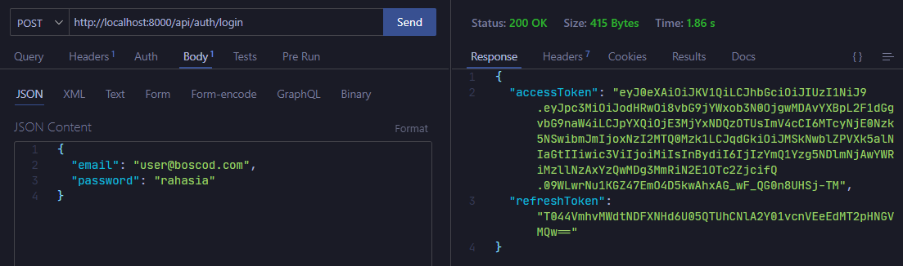
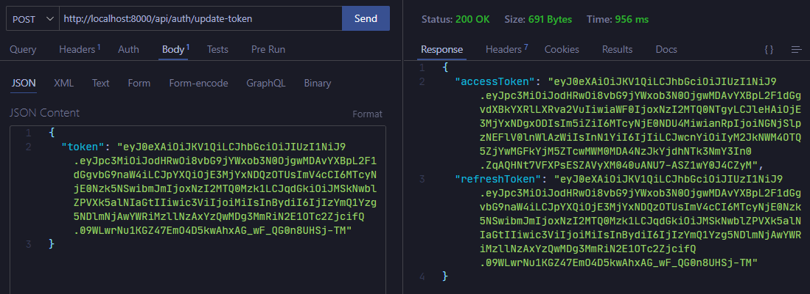
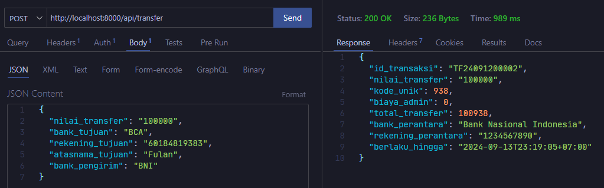

# Transfer API Laravel Project

A Laravel-based API system for handling bank transfers, including user authentication and transaction management.

## Requirements

Before you begin, ensure you have met the following requirements:

-   PHP >= 8.2
-   Composer
-   Laravel 11
-   MySQL

## Installation

Follow these steps to set up the project locally:

1. **Clone the repository:**

    ```bash
    git clone https://github.com/your-username/your-repo-name.git
    cd your-repo-name
    ```

2. **Install dependencies:** Run Composer to install the PHP dependencies

    ```bash
    composer install
    ```

3. **Set up environment:** Copy the .env.example file to create your environment file

    ```bash
    cp .env.example .env
    ```

    **Configure your .env file with the correct database credentials:**
    DB_CONNECTION=mysql
    DB_HOST=127.0.0.1
    DB_PORT=3306
    DB_DATABASE=laravel_transfer_bank
    DB_USERNAME=your_database_user
    DB_PASSWORD=your_database_password

4. **Generate application key:**

    ```bash
    php artisan key:generate
    php artisan jwt:secret
    ```

5. **Run migrations or import database:**
   Import database :

    1. Go to localhost/phpmyadmin
    2. Import and choose file database backup ./laravel_transfer_bank
    3. Click import

    or

    Run migration(If you use this method, you must create dummy data first so that the application runs) :

    ```bash
    php artisan migrate
    ```

6. **Run the development server:**

    ```bash
    php artisan serve
    ```

    The project will be accessible at http://localhost:8000.

## API Endpoints

1. **Authentication**

    - Login: POST /api/auth/login

    ```json
    {
        "email": "user@boscod.com",
        "password": "rahasia"
    }
    ```

    -Refresh Token: POST /api/auth/update-token

    ```json
    {
        "token": "YOUR_JWT_TOKEN"
    }
    ```

2. **Transfer**
    - Create Transfer: POST /api/transfer
    ```json
    {
        "nilai_transfer": "50000",
        "bank_tujuan": "BCA",
        "rekening_tujuan": "60184819383",
        "atasnama_tujuan": "Fulan",
        "bank_pengirim": "BNI"
    }
    ```

## Screenshots


_Login_


_Refresh Token_


_Transfer_
